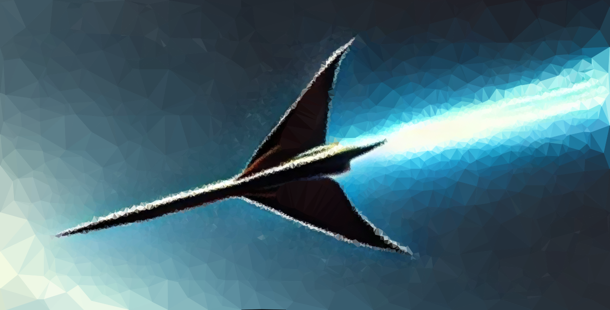

# Javelin

Javelin is a framework that enables **graphics programming** entirely within in **C++**.

## Appetizer

...

Shader programs can be defined completely in **C++**

```cpp
template <size_t B>
$subroutine(...)
{

}

$subroutine()
{

}

$entrypoint(...)
```

Please see the `examples` directory for more in-depth samples.

## Features

### Interface

- [x] fdfdfsff
- [ ] xxx

### Targets

- GLSL code generation **(stable)**
- SPIRV binary compilation:
    - Through glslang **(stable)**
- C++ code generation:
    - Through libgccjit **(unstable)**
- CUDA kernel generation **(planned)**

## Usage

### Building

requires **C++20** support
...

### Headers

...